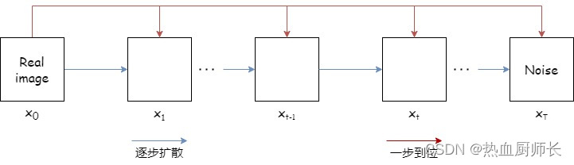
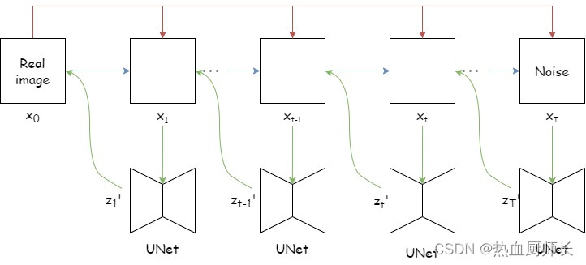

# DDPM (Denoising Diffusion Probabilistic Models)
## Diffusion 阶段
本阶段不断地给真实图片加噪声，经过\(T\)步加噪之后，噪声强度不断变大，得到一张完全为噪声的图像。

\[X_{t}=\sqrt{1 - \beta_{t}}*X_{t - 1}+\sqrt{\beta_{t}}*Z_{t}~~~~~~~~~~Z_{t}\sim N(0, I)\]

$Z_t$是对应时间产生的随机噪声，$\beta_t$是超参数，其经验值范围是$[10^{-4},0.02]$线性变化，而且一般来说，$t$越大，$\beta_t$的取值也就越大。

1. 令 \(\alpha_t = 1 - \beta_t\)，那么 \(X_t = \sqrt{\alpha_t}*X_{t - 1} + \sqrt{1 - \alpha_t}*Z_t\)
2. 将 \(X_{t - 1}\) 代入到 \(X_t\) 的公式中，得：
\(X_{t}=\sqrt{\alpha_t}(\sqrt{\alpha_{t - 1}}*X_{t - 2} + \sqrt{1 - \alpha_{t - 1}}*Z_{t - 1})+\sqrt{1 - \alpha_t}*Z_t=\sqrt{\alpha_t\alpha_{t - 1}}*X_{t - 2}+\sqrt{\alpha_t - \alpha_t\alpha_{t - 1}}*Z_{t - 1}+\sqrt{1 - \alpha_t}*Z_t\)
3. \(Z_t\)、\(Z_{t - 1}\)是从均值为 \(0\)，方差为单位矩阵的正态分布的两次独立采样，所以：
\(\sqrt{\alpha_t - \alpha_t\alpha_{t - 1}}*Z_{t - 1} \sim N(0, (\alpha_t - \alpha_t\alpha_{t - 1})*I)\)
\(\sqrt{1 - \alpha_t}*Z_{t - 1} \sim N(0, (1 - \alpha_t)*I)\)
4. 二者相加，即为方差相加，得：\(N(0, (1 - \alpha_t\alpha_{t - 1})*I)\)
5. 所以\(X_{t - 1}\)的公式可以写成：
\(X_{t - 1} = \sqrt{\alpha_t\alpha_{t - 1}}*X_{t - 2} + \sqrt{1 - \alpha_t\alpha_{t - 1}}*Z \qquad\qquad\qquad Z \sim N(0,I)\)
6. 那其实足以看出，从\(X_0\)推导至任意\(X_t\)，有：
\(X_t = \sqrt{\alpha_t\alpha_{t - 1}\dots\alpha_1}*X_0 + \sqrt{1 - \alpha_t\alpha_{t - 1}\dots\alpha_1}*Z \qquad\quad Z \sim N(0,I)\)

## Reverse 阶段
先根据 $X_t$ 预测出 $\widetilde{Z}$，求出 $X_{t - 1}$，然后逐步逐步得到 $X_0$，这个过程如下图所示：

现在我们知道 \(\widetilde{Z} = UNet(X_t, t)\)，整个reverse过程中，就只剩下\(x_{t - 1} = f(X_t, \widetilde{Z})\)的\(f\)还没搞清楚了。我们要推理\(X_t\rightarrow X_{t - 1}\)的过程，相当于已知\(X_t\)的概率，去求\(X_{t - 1}\)的条件概率，即计算\(q(X_{t - 1}|X_t)\)，根据贝叶斯公式，有：

\(q(X_{t - 1}|X_t) = \frac{q(X_t X_{t - 1})}{q(X_t)} = \frac{q(X_t|X_{t - 1})q(X_{t - 1})}{q(X_t)}\)