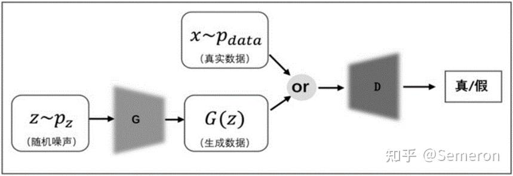

# GAN-生成对抗网络

## 模型架构


## 生成器损失函数
$\min\limits_{G}\max\limits_{D} V(D,G) = \min\limits_{G}\max\limits_{D}[E_{x\sim p_{data}(x)}\log D(x) + E_{z\sim p_{data}(z)}\log (1-D(G(z)))]$

其中，$z$ 表示随机噪声，$x$ 表示真实数据。
用交叉熵表示样本的混乱程度，该损失函数的意思就是，首先，真实数据 $x$ 通过判别器 $D$，生成一个概率 $D(x)$，随机噪声 $z$ 通过生成器 $G$ 生成一个假样本 $G(z)$，然后再通过判别器生成一个概率 $D(G(z))$。对于判别器而言，它想尽可能的区分出真假样本，于是取 max；对于生成器而言，它想尽可能的生成逼真的样本，于是取 min。

**note：** 在实际代码实现中，loss 并不是这样做的，对于判别器 D，它的损失函数是真假样本与真实标签（真或假）的 BCEloss。对于生成器 G，它的损失函数是假样本与真标签的BCEloss。

## Usage
使用默认参数训练 GAN：
```bash
python main.py
```
